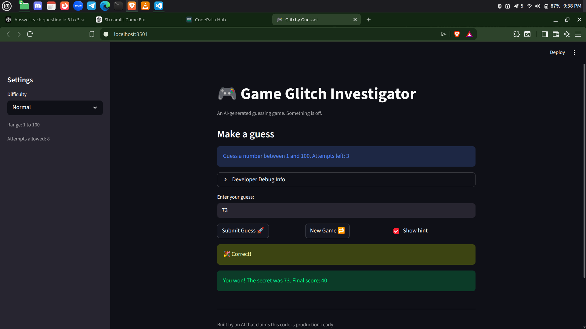
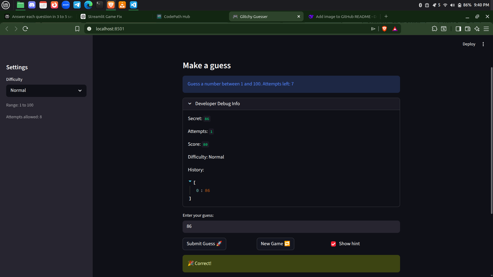

# 🎮 Game Glitch Investigator: The Impossible Guesser

## 🚨 The Situation

You asked an AI to build a simple "Number Guessing Game" using Streamlit.
It wrote the code, ran away, and now the game is unplayable. 

- You can't win.
- The hints lie to you.
- The secret number seems to have commitment issues.

## 🛠️ Setup

1. Install dependencies: `pip install -r requirements.txt`
2. Run the broken app: `python -m streamlit run app.py`

## 🕵️‍♂️ Your Mission

1. **Play the game.** Open the "Developer Debug Info" tab in the app to see the secret number. Try to win.
2. **Find the State Bug.** Why does the secret number change every time you click "Submit"? Ask ChatGPT: *"How do I keep a variable from resetting in Streamlit when I click a button?"*
3. **Fix the Logic.** The hints ("Higher/Lower") are wrong. Fix them.
4. **Refactor & Test.** - Move the logic into `logic_utils.py`.
   - Run `pytest` in your terminal.
   - Keep fixing until all tests pass!

## 📝 Document Your Experience

- [Done] Describe the game's purpose.
The purpose of the game is to guess a secret number within a limited number of attempts. The player receives hints after each guess indicating whether the guess is too high, too low, or correct. The game also tracks attempts, score, and difficulty levels.

- [Done] Detail which bugs you found.
The first time I ran the game, it showed a simple “Guess a number between 1 and 100” interface with an attempts counter and some buttons like New Game, difficulty options, hints, and developer info. I noticed that after my first guess, the remaining attempts number on the UI did not decrease, even though the game actually ended after I used what looked like my “last” attempt. I also saw that the New Game button didn’t actually restart the game, so I had to refresh the whole app to play again. The difficulty setting was clearly broken, because even on easier modes the app still asked me to guess numbers outside the supposed range. On top of that, the hint system was backwards or misleading, and the developer info/history section didn’t update to show the latest round. Moreover, once I win the game and click on the new game the developer debug info doesn't appear.

- [Done] Explain what fixes you applied.
I fixed the main issue by storing the secret number in st.session_state so it persists between reruns instead of being regenerated every time. I also ensured the guess comparison logic worked correctly by properly handling types and verifying the hint logic with tests. Finally, I used pytest to confirm that the guessing logic returned the correct outcomes for win, too high, and too low cases.

## 📸 Demo

- [Done] [Insert a screenshot of your fixed, winning game here]

## 🚀 Stretch Features

- [ ] [If you choose to complete Challenge 4, insert a screenshot of your Enhanced Game UI here]
